# Euro24 App

## Overview

Euro24 App is an Android application developed using Kotlin and the MVVM architecture. It provides comprehensive information about the UEFA European Championship 2024. Users can explore match details, schedules, group standings, teams, players, host cities, stadiums, and historical winners. Additionally, the app allows users to edit match results, dynamically updating standings and knockout phase fixtures.

## Features

- **Match Information**: View details of each match including date, time, venue and teams.
- **Schedules**: Access the full schedule of matches in the tournament.
- **Group Standings**: Keep track of group standings with real-time updates based on entered match results.
- **Teams, Head Managers and Players**: Explore detailed information about participating teams and their head managers and players.
- **Host Cities and Stadiums**: Discover information about the cities and stadiums hosting the tournament.
- **Historical Data**: Review the winners and runners-up from previous editions of the tournament.
- **Result Editing**: Enter match results to update standings and fixtures automatically.

## Installation

1. Clone this repository to your local machine:
   ```bash
   git clone https://github.com/jorge-lobo/euro-24.git
   ```
2. Open the project in Android Studio.
3. Build the project to install dependencies.
4. Run the app on an emulator or a physical device.

## Usage

### Initial Setup

- Upon launching the app, it checks for an internet connection to fetch images.
- If no connection is detected, a prompt will request the user to connect to Wi-Fi.

### Main Features

- **Home Screen**: Overview of current day's fixtures.
- **Matches**: Detailed list of matches, with options to view or edit match results.
- **Groups**: Group stage standings, updated based on match results.
- **Teams**: Detailed information about participating teams.
- **Players**: Player profiles and statistics.
- **Host Cities**: Information about cities hosting the tournament.
- **Stadiums**: Detailed view of stadiums used in the tournament.
- **History**: Review past tournament winners and notable historical data.

## Screenshots

<div align="center">
    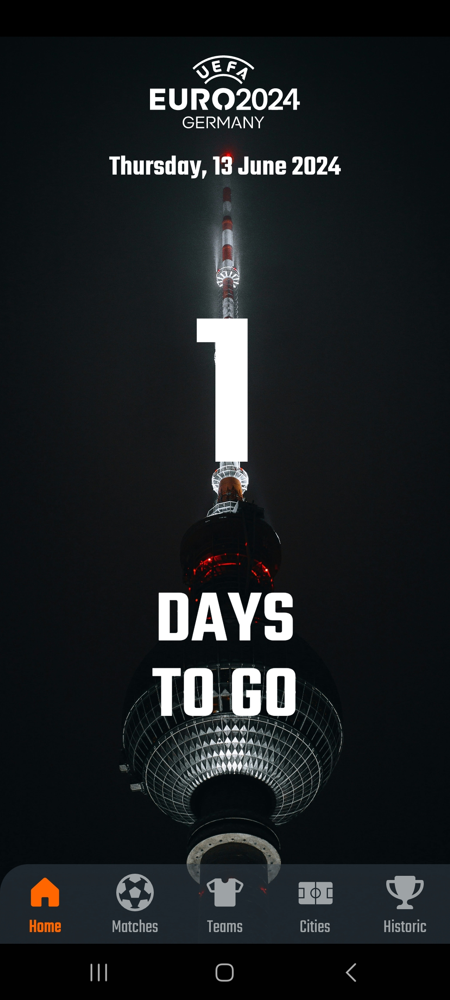
    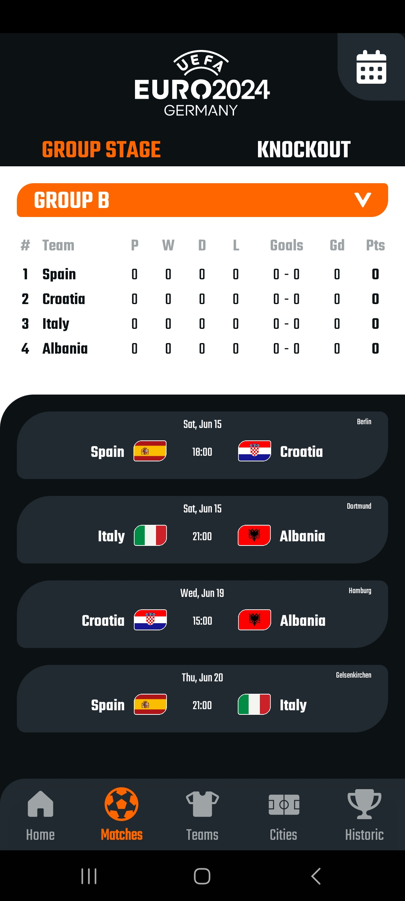
    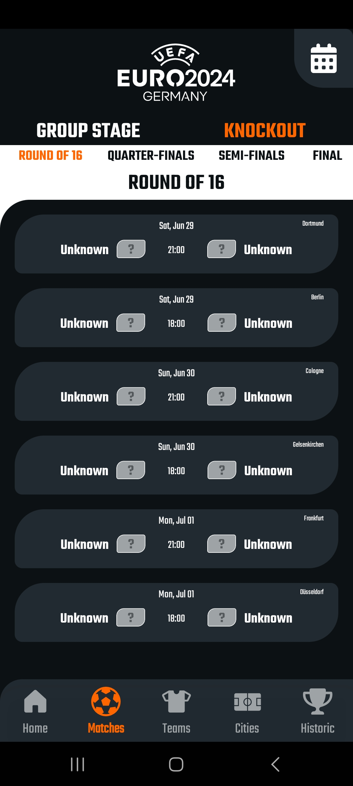
    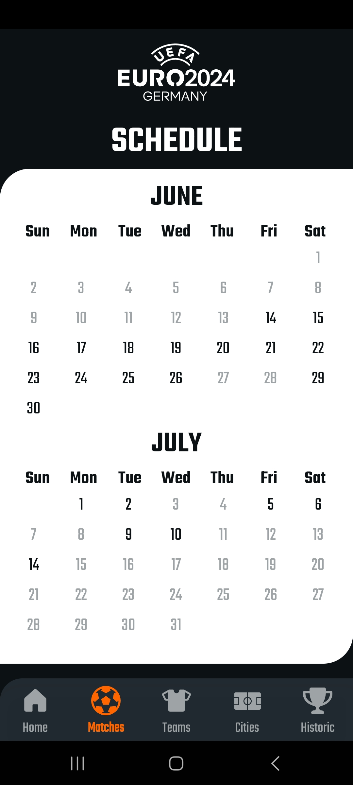<br><br>
    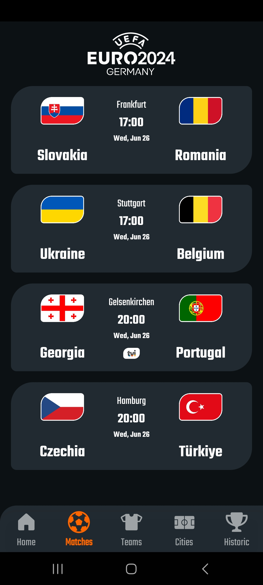
    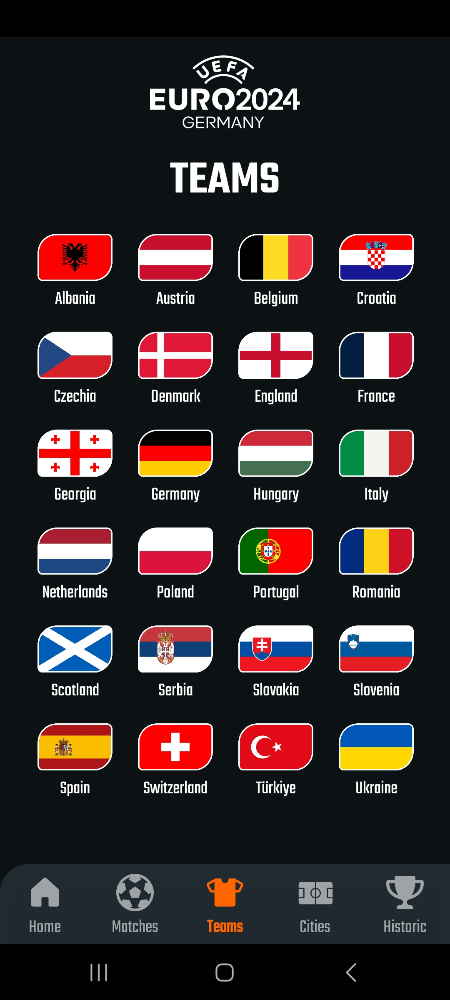
    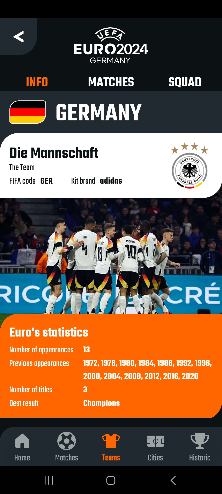
    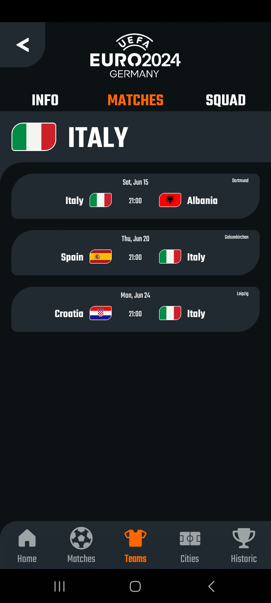<br><br>
    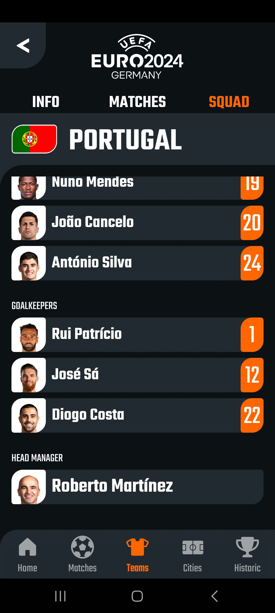
    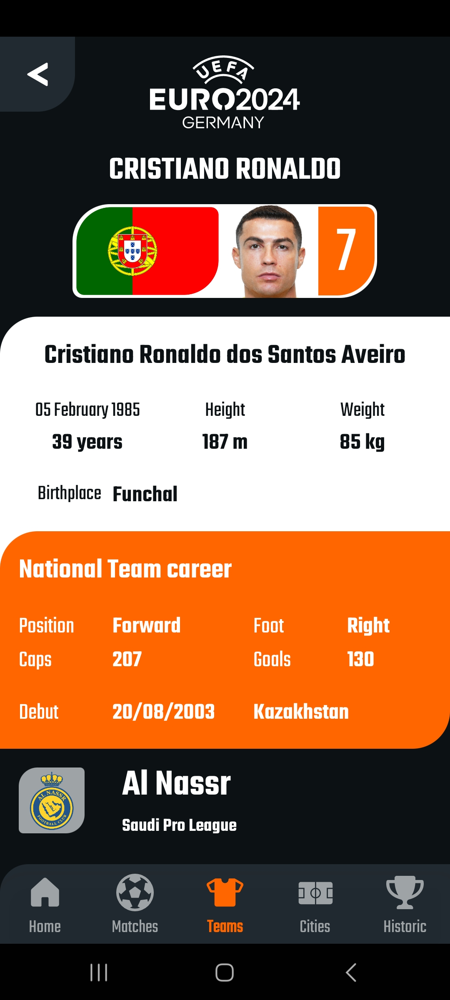
    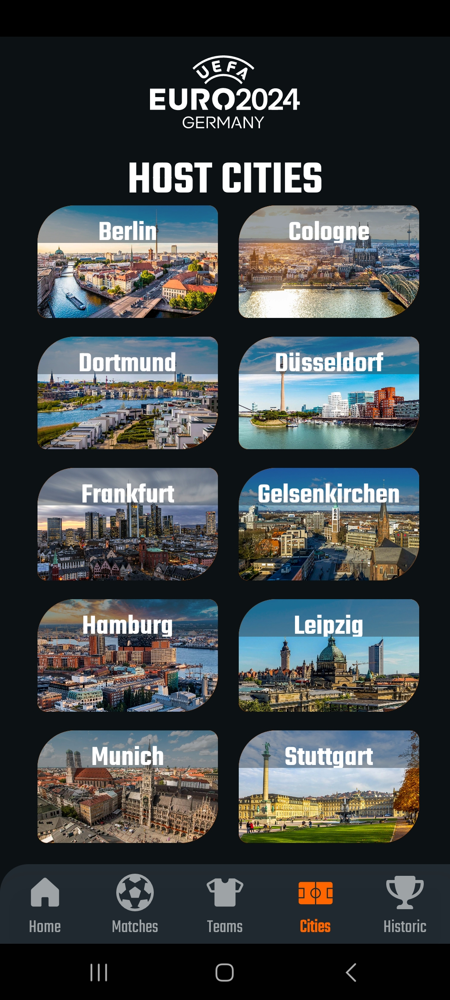
    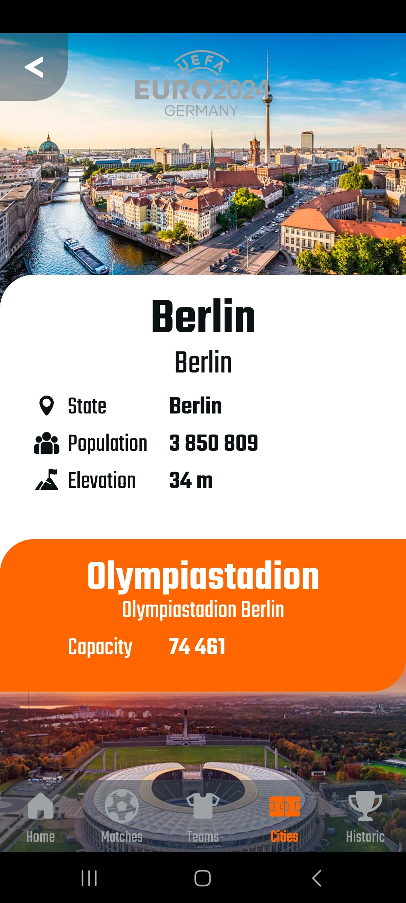<br><br>
    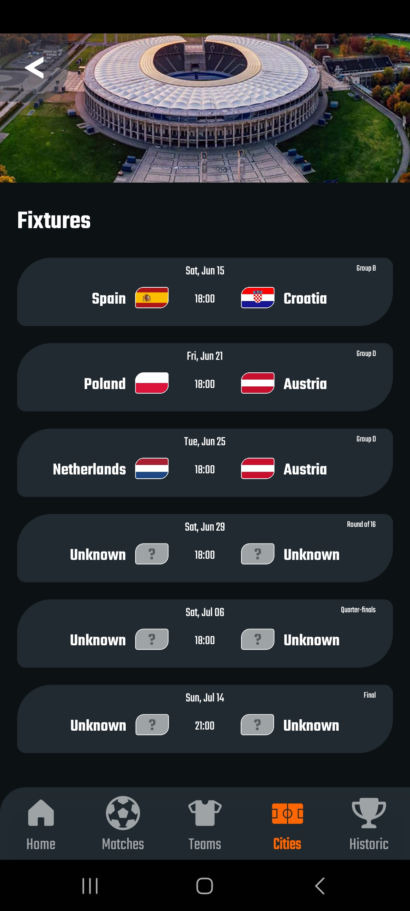
    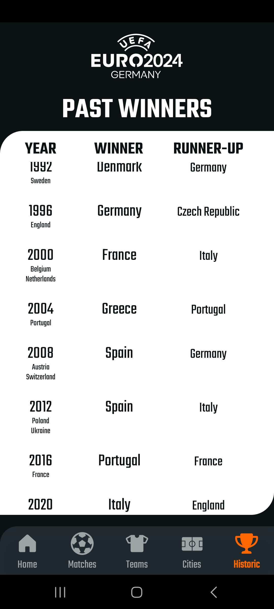
</div>

## Contact

If you have any questions or suggestions, please feel free to reach out:

- **Email**: jorge-lobo@outlook.pt
- **GitHub**: [jorge-lobo](https://github.com/jorge-lobo)

---
